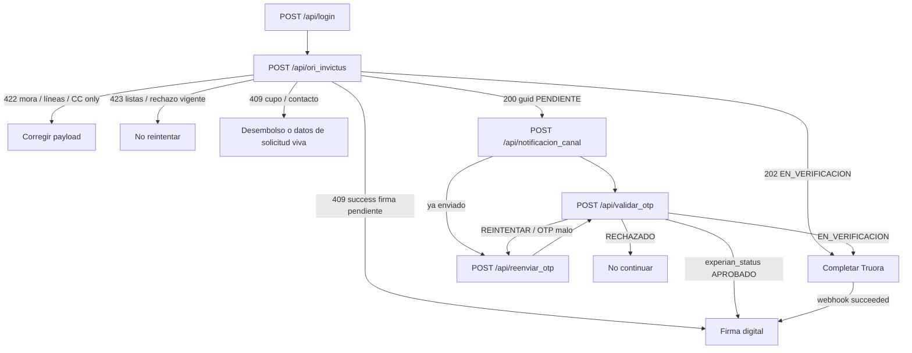
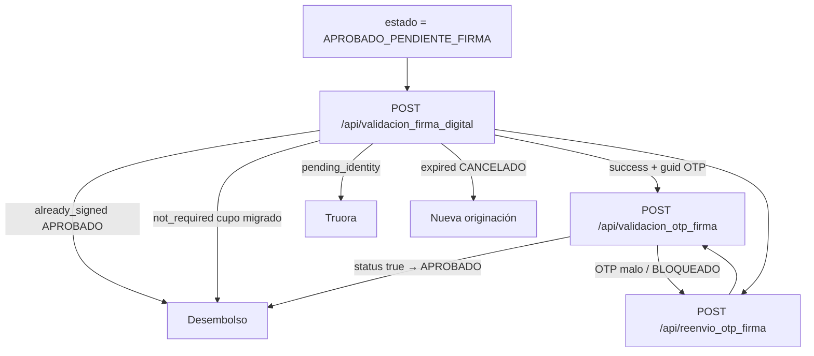
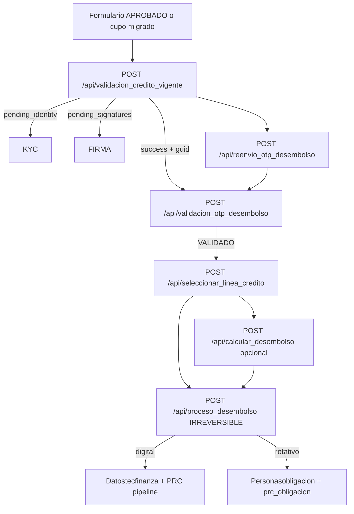

# Mapa Invictus: originación → firma → desembolso

Fuente: código TESEO (`Api::InvictusController`, `Api::InvictusFirmaController`, `Api::InvictusDesembolsoController`, servicios y jobs). **No hay un modelo `Formulariosinvictus`**: la solicitud vive en `Formulario` (`portafolio_id: 10053`, `tipo: 'INVICTUS'`).

Catálogo hermano (APIs distintas, no mezclar `guid`): [Onboarding](onboarding_flujo.md).

Este documento es el **mapa técnico y funcional**. Cada API tiene su página; Swagger (botón **Documentación** en `/api/docs/invictus`) resume el mismo flujo para consumo.

## Qué es Invictus en TESEO

Invictus es el cliente (punto Gana / app). TESEO expone APIs JWT. El flujo real es:

1. **Auth** — `POST /api/login` emite JWT (1 hora).
2. **Originación** — crea o retoma `Formulario`, envía OTP, decide (listas / Experian / Truora).
3. **Firma digital** — OTP de firma; pasa a `APROBADO`; PDFs en rotativo.
4. **Desembolso** — OTP de desembolso, líneas, simulación, `proceso_desembolso` irreversible.

KYC Truora **no** es un endpoint del catálogo Invictus: cierra originación vía webhook cuando `estado_invictus = EN_VERIFICACION`.

## Diagrama general

```mermaid
flowchart LR
  subgraph auth [Auth]
    L["POST /api/login"]
  end

  subgraph ori [Originación]
    O["POST /api/ori_invictus"]
    N["POST /api/notificacion_canal"]
    R["POST /api/reenviar_otp"]
    V["POST /api/validar_otp"]
    T["Webhook Truora KYC"]
  end

  subgraph fir [Firma digital]
    F1["POST /api/validacion_firma_digital"]
    F2["POST /api/validacion_otp_firma"]
    F3["POST /api/reenvio_otp_firma"]
  end

  subgraph des [Desembolso]
    D1["POST /api/validacion_credito_vigente"]
    D2["POST /api/validacion_otp_desembolso"]
    D3["POST /api/reenvio_otp_desembolso"]
    D4["POST /api/seleccionar_linea_credito"]
    D5["POST /api/calcular_desembolso"]
    D6["POST /api/proceso_desembolso"]
  end

  L --> O --> N --> V
  N --> R --> V
  V -->|APROBADO_PENDIENTE_FIRMA| F1
  V -->|EN_VERIFICACION| T --> F1
  F1 --> F2
  F1 --> F3 --> F2
  F2 -->|APROBADO| D1
  D1 --> D2
  D1 --> D3 --> D2
  D2 --> D4 --> D5 --> D6
  D4 --> D6
```

## Estados de `Formulario.estado_invictus` (código)

| Estado | Quién lo pone | Qué sigue |
|--------|---------------|-----------|
| `PENDIENTE` | `ori_invictus` (alta o reset Experian sin decisión) | `notificacion_canal` → `validar_otp` |
| `EN_VERIFICACION` | `validar_otp` (Experian pide KYC) | Esperar Truora. No firma. |
| `APROBADO_PENDIENTE_FIRMA` | `validar_otp` (lista blanca / Experian APROBADO) o Truora OK | Firma digital |
| `APROBADO` | `validacion_otp_firma` OK | Desembolso |
| `DESEMBOLSADO` | `proceso_desembolso` | Fin. No repetir. |
| `RECHAZADO` | Listas / Experian / Truora fraude | Cooldown (típicamente 30 días; KYC intentos 1 día) |
| `CANCELADO` | Caducidad `PENDIENTE` / `CON_CUPO` viejo | Nueva originación |
| `CON_CUPO` | `ori_invictus` si ya hay cupo usable | Ir a desembolso, no originar otra |

Contacto “vivo” (bloquea email/celular en otra cédula): estados **fuera** de `RECHAZADO`, `CANCELADO`, `SOLICITUD_POR_ERROR`, `VENCIDO`, `DESEMBOLSADO`, `CON_CUPO`.

## Diagrama detallado — Originación

**Componentes:** `CredintegralSolicitudElegibilidadService`, `ListasrestrictivasController.consultar_externa`, `Listascontrol` (negra/blanca), `ExperianService` / cache 30d / `InvictusExperianSimulacion`, `InvictusTruoraService`, `InvictusOtpReenvioLimite`, `InvictusOtpValidacionLimite`, SMS (`WssmsController`), email Sygmail, WhatsApp (`WswolboxsController` 6718), `ProcesoJob` (`prc_teseo_demografico`, `prc_crediintegral`) si se crea `Persona` rotativo.

**Auth originación/firma/desembolso Invictus:** JWT `Authorization: Bearer`. JSON de error **401** `{ status: "error", mensaje: "Token de autorización inválido o ausente" }` (distinto del login, que usa `status: true/false`).

## Diagrama detallado — Firma digital

Firma **no llama Truora**. Solo lee `EN_VERIFICACION`. Docs PDF (14222, 14202, 14203) solo si **rotativo** (`!digital?`). Digital firma igual (OTP → `APROBADO`) y genera docs en desembolso.

OTP firma vive en `Validacionesotp` (PENDIENTE → VALIDADO / EXPIRADO / BLOQUEADO). `tiempo_vigencia` del body se exige pero **la expiración usa el valor persistido** (default 5 min).

## Diagrama detallado — Desembolso

Elegibilidad: `InvictusDesembolsoElegibilidadService` (mora, cupo digital vs rotativo, expiración 181 días no migrado, cancelado).

`validacion_otp_desembolso` **no devuelve líneas**. Las líneas salen de `seleccionar_linea_credito` (OTP debe estar `VALIDADO`). `calcular_desembolso` es simulación **sin persistir** y **no exige OTP**. `proceso_desembolso` marca OTP `DESEMBOLSADO` **antes** de crear negocio (anti doble clic).

`proceso_desembolso` **no** inserta recaudo ni asientos. El JSON trae `instrucciones_invictus` para que el cliente Invictus replique caja/cartera/contabilidad.

## APIs por etapa

| Etapa | Método | Ruta | Página |
|-------|--------|------|--------|
| Auth | POST | `/api/login` | [Token](tecfinanzas_token.md) |
| Originación | POST | `/api/ori_invictus` | [Originación](invictus_originacion_import.md) |
| Originación | POST | `/api/notificacion_canal` | [Notificación OTP](invictus_notificacion.md) |
| Originación | POST | `/api/reenviar_otp` | [Reenviar OTP](invictus_reenviar_validacion.md) |
| Originación | POST | `/api/validar_otp` | [Validar OTP](invictus_validacion.md) |
| KYC | webhook | `truora/webhook_invictus` | [Truora KYC](invictus_truora_kyc.md) |
| Firma | POST | `/api/validacion_firma_digital` | [Validación firma](validacion_firma_digital.md) |
| Firma | POST | `/api/validacion_otp_firma` | [OTP firma](validacion_otp_firma_digital.md) |
| Firma | POST | `/api/reenvio_otp_firma` | [Reenvío OTP firma](validacion_reenvio_otp_firma.md) |
| Desembolso | POST | `/api/validacion_credito_vigente` | [Crédito vigente](invictus_desmebolso_validacion.md) |
| Desembolso | POST | `/api/validacion_otp_desembolso` | [OTP desembolso](invictus_desembolso_otp_valida.md) |
| Desembolso | POST | `/api/reenvio_otp_desembolso` | [Reenvío OTP desembolso](invictus_desembolso_reenvio_otp.md) |
| Desembolso | POST | `/api/seleccionar_linea_credito` | [Líneas](invictus_desembolso_linea_credito.md) |
| Desembolso | POST | `/api/calcular_desembolso` | [Cálculo](invictus-calculo-desembolso.md) |
| Desembolso | POST | `/api/proceso_desembolso` | [Desembolso](invictus_desmebolso.md) |

## Cómo leer respuestas (regla de oro)

Muchos casos de negocio usan **HTTP 200** y hay que mirar el campo JSON `status` / `experian_status`, no solo el código HTTP.

| Patrón | Dónde |
|--------|--------|
| HTTP 200 + `status: "error"` | Listas, OTP malo en varios flujos, límites de reenvío |
| HTTP 200 + `experian_status: RECHAZADO` con `status: "success"` | `validar_otp` Experian rechaza crédito |
| HTTP 409 + `status: "success"` | `ori_invictus` ya `APROBADO_PENDIENTE_FIRMA` |
| HTTP 202 | Retoma `EN_VERIFICACION` en `ori_invictus` |
| `status` boolean en firma OTP | `validacion_otp_firma` usa `true`/`false`, no `"success"` |
| Login `status: true` | Distinto del resto Invictus (`"success"` / `"error"`) |

## Inconsistencias docs antiguas vs código

1. **`POST /api/validar_linea_credito` no existe.** La página histórica [Aprobación de línea](invictus_aprobacion_linea.md) documentaba un contrato inventado. En código la selección de línea es `POST /api/seleccionar_linea_credito` (desembolso, no originación).
2. **`tiposdocumento_id` en originación: solo CC (`"1"`).** Tablas CE/NIT/PA/PEP en docs viejas no aplican a `ori_invictus`.
3. **OTP de originación se genera en `create` pero no se envía** hasta `notificacion_canal`.
4. **`otp_expiracion_minutos_invictus` se lee en originación pero `validar_otp` no lo aplica** (el mensaje dice “expirado” sin chequeo de tiempo).
5. **`validacion_otp_desembolso` no retorna `lineas_credito`.** Eso es `seleccionar_linea_credito`.
6. **`calcular_desembolso` no exige OTP.**
7. **`proceso_desembolso` no afecta caja/contabilidad en TESEO**; solo instrucciones al cliente Invictus.
8. Comentarios en `InvictusController` (“WhatsApp/Truora pendiente”) están **desactualizados**: el código sí envía WhatsApp y llama Truora.

## Parámetros de negocio (portafolio 10053)

| Parámetro | Default en código | Uso |
|-----------|-------------------|-----|
| `CAMPOS VALIDACION ORIGINACION INVICTUS` | CSV | Campos obligatorios de `datos` |
| `horas_expiracion_solicitud_pendiente` | 2 | Retoma `PENDIENTE` |
| `max_reenvios_otp_invictus` | 3 | Reenvíos originación/firma |
| `cooldown_reenvio_otp_minutos` | 30 | Tras tope de reenvíos |
| `tiempo_minimo_reenvio_otp_segundos` | 60 | Espera entre reenvíos |
| `total_intentos_otp` | 3 | Fallos OTP originación/firma |
| `total_intentos_otp_desembolso` | 3 | Fallos OTP desembolso |
| `otp_expiracion_minutos_invictus` | 5 | Vigencia firma (y config originación) |
| Reenvíos desembolso | máx 5 en código | `reenvio_otp_desembolso` |

## Swagger

En TESEO (dev / testing-sygma / `API_SWAGGER=1`): `/api/docs/invictus`

- **Ver flujo** — slides Auth → Originación → Firma → Desembolso.
- **Documentación** — guía por endpoint (mismo mapa que esta página, compacta para operar).
