# Mapa Onboarding cupo fijo: originación → firma → desembolso

Fuente funcional: Invictus DIGITAL (`Api::InvictusController`, `Api::InvictusFirmaController`, `Api::InvictusDesembolsoController`, `InvictusDigitalLineaService`, `PlaneshsimulaCreditoService`). **Rutas distintas.** **No modifica Invictus.**

Producto: **cupo fijo** (línea `RIS CUPO FIJO`, `tipo_linea: DIGITAL`, `monto_fijo: SI`). No rotativo. No `fnc_json_credintegral`. No `CREAROBLCUOTAMANEJO`.

Auth: `POST /api/onboarding/autenticar` (JWT 1h). Swagger: `/api/docs/onboarding`.

Carpetas: [Originación](originacion/index.md) · [Firma](firma/index.md) · [Desembolso](desembolso/index.md).

## Estado de implementación

| Grupo | En `routes.rb` |
|-------|----------------|
| `autenticar`, `simular`, `informacion_basica` | **Sí** |
| OTP originación, Truora, firma, desembolso | **No** (contrato de este mapa) |

Cliente **no** debe pegar `/api/ori_invictus`, `/api/validacion_firma_digital`, `/api/proceso_desembolso`, etc. Esas son Invictus.

## Diagrama general

```mermaid
flowchart LR
  subgraph auth [Auth]
    A["POST /api/onboarding/autenticar"]
  end

  subgraph pre [Pre-originación]
    S["POST /api/onboarding/simular"]
  end

  subgraph ori [Originación]
    I["POST /api/onboarding/informacion_basica"]
    N["POST /api/onboarding/notificacion_canal"]
    R["POST /api/onboarding/reenviar_otp"]
    V["POST /api/onboarding/validar_otp"]
    T["Webhook Truora Onboarding"]
  end

  subgraph fir [Firma]
    F1["POST /api/onboarding/validacion_firma_digital"]
    F2["POST /api/onboarding/validacion_otp_firma"]
    F3["POST /api/onboarding/reenvio_otp_firma"]
  end

  subgraph des [Desembolso]
    D1["POST /api/onboarding/validacion_credito_vigente"]
    D2["POST /api/onboarding/validacion_otp_desembolso"]
    D3["POST /api/onboarding/reenvio_otp_desembolso"]
    D4["POST /api/onboarding/seleccionar_linea_credito"]
    D5["POST /api/onboarding/calcular_desembolso"]
    D6["POST /api/onboarding/proceso_desembolso"]
  end

  A --> S --> I --> N --> V
  N --> R --> V
  V -->|APROBADO_PENDIENTE_FIRMA| F1
  V -->|EN_VERIFICACION| T --> F1
  F1 --> F2
  F1 --> F3 --> F2
  F2 -->|APROBADO| D1
  D1 --> D2
  D1 --> D3 --> D2
  D2 --> D4 --> D5 --> D6
```

## Envelope

Negocio Onboarding (implementado hoy): `{ "status": "success|error", "datos": {}, "errors": [] }`.

JWT 401 (`ApiJwtAuthenticatable`): `{ "status": "error", "mensaje": "..." }`.

Etapas copia Invictus: mismos `status` de negocio (`pending_identity`, `already_signed`, `otp_not_validated`, `already_disbursed`, …). Mirar **campo `status`**, no solo HTTP.

## Cupo fijo vs Invictus rotativo

| Tema | Invictus mixto | Onboarding cupo fijo |
|------|----------------|----------------------|
| Línea | DIGITAL + rotativo Oracle | Solo `RIS CUPO FIJO` |
| `monto_fijo` | DIGITAL=`SI`, rotativo=`NO` | Siempre `SI` |
| Valor desembolso | Rotativo: parcial ≤ disponible | **Exacto** al cupo asignado |
| Plazo | Rotativo hasta 12 | 1–6 (`onboarding_sim_plazo_*`) |
| Cálculo | Digital: `planeshsimula`. Rotativo: `prc_simulador_crediintegral` | Solo `PlaneshsimulaCreditoService` |
| Firma PDFs 14222/14202/14203 | Rotativo en OTP firma | **No** en firma. Docs en desembolso |
| Pipeline desembolso | Digital: `Datostecfinanza` + PRC. Rotativo: `Personasobligacion` | Solo digital |
| `id_linea_credito` | `91000000000 + form.id` (DIGITAL) | Igual, sobre `Formulario` Onboarding |

## Estados (`estado_invictus` / equivalente Onboarding)

Misma máquina Invictus, sobre `Formulario` `tipo` = `onboarding_formulario_tipo` (10053 suele `DIGITAL`):

| Estado | Quién | Qué sigue |
|--------|-------|-----------|
| `PENDIENTE` | `informacion_basica` / alta OTP | `notificacion_canal` → `validar_otp` |
| `EN_VERIFICACION` | `validar_otp` (Experian pide KYC) | Webhook Truora. No firma |
| `APROBADO_PENDIENTE_FIRMA` | OTP OK o Truora OK | Firma |
| `APROBADO` | OTP firma OK | Desembolso |
| `DESEMBOLSADO` | `proceso_desembolso` | Fin. No repetir |
| `RECHAZADO` | Listas / Experian / Truora | Cooldown |
| `CANCELADO` | Caducidad | Nueva originación |

## APIs

| Etapa | Método | Ruta | Código | Página |
|-------|--------|------|--------|--------|
| Auth | POST | `/api/onboarding/autenticar` | Sí | [Autenticar](originacion/autenticar.md) |
| Simulación previa | POST | `/api/onboarding/simular` | Sí | [Simular](originacion/simular.md) |
| Originación datos | POST | `/api/onboarding/informacion_basica` | Sí | [Información básica](originacion/informacion_basica.md) |
| Originación OTP | POST | `/api/onboarding/notificacion_canal` | No | [Notificación](originacion/notificacion.md) |
| Originación OTP | POST | `/api/onboarding/reenviar_otp` | No | [Reenviar OTP](originacion/reenviar_otp.md) |
| Originación decisión | POST | `/api/onboarding/validar_otp` | No | [Validar OTP](originacion/validar_otp.md) |
| KYC | webhook | `truora/webhook_onboarding` | No | [Truora](originacion/truora_kyc.md) |
| Firma | POST | `/api/onboarding/validacion_firma_digital` | No | [Firma](firma/validacion_firma_digital.md) |
| Firma | POST | `/api/onboarding/validacion_otp_firma` | No | [OTP firma](firma/otp_firma.md) |
| Firma | POST | `/api/onboarding/reenvio_otp_firma` | No | [Reenvío OTP firma](firma/reenvio_otp_firma.md) |
| Desembolso | POST | `/api/onboarding/validacion_credito_vigente` | No | [Crédito vigente](desembolso/credito_vigente.md) |
| Desembolso | POST | `/api/onboarding/validacion_otp_desembolso` | No | [OTP desembolso](desembolso/otp_desembolso.md) |
| Desembolso | POST | `/api/onboarding/reenvio_otp_desembolso` | No | [Reenvío OTP desembolso](desembolso/reenvio_otp_desembolso.md) |
| Desembolso | POST | `/api/onboarding/seleccionar_linea_credito` | No | [Línea](desembolso/linea_credito.md) |
| Desembolso | POST | `/api/onboarding/calcular_desembolso` | No | [Cálculo](desembolso/calcular_desembolso.md) |
| Desembolso | POST | `/api/onboarding/proceso_desembolso` | No | [Proceso](desembolso/proceso_desembolso.md) |

`simular` = cotización **antes** de originar. `calcular_desembolso` = mismo motor **en desembolso**, con `guid` OTP y `id_linea_credito`. No son intercambiables.

## Componentes (reutilizar, no copiar Invictus)

| Pieza Invictus | Uso Onboarding cupo fijo |
|----------------|--------------------------|
| `AuthenticateUser` / JWT | Auth propia |
| SMS / Sygmail / Wolbox 6718 | OTP originación, firma, desembolso |
| `InvictusOtpReenvioLimite` / `InvictusOtpValidacionLimite` | Límites OTP |
| Listas + Experian + `InvictusTruoraService` | `validar_otp` |
| `Validacionesotp` | Firma y desembolso |
| `PlaneshsimulaCreditoService` | `simular` + `calcular_desembolso` |
| `InvictusDigitalLineaService` | Línea, `validar_cupo!`, `desembolsar!` (filtrar `tipo` Onboarding) |
| `Datostecfinanza` + `prc_tecfinanzas` + `prc_procesocrediintegral` + `prc_obligacion` | `proceso_desembolso` |

Aislamiento: `Formulario` por `tipo` Onboarding + `portafolio_id`. No tocar `tipo: INVICTUS`.
