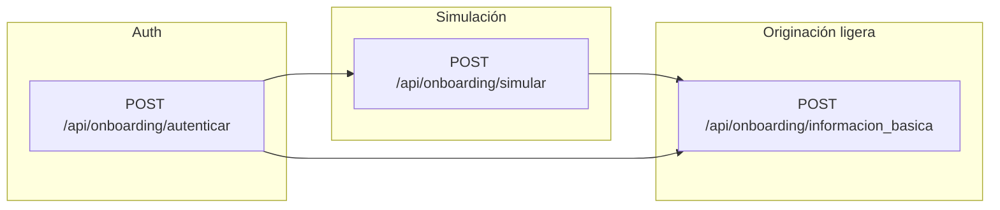
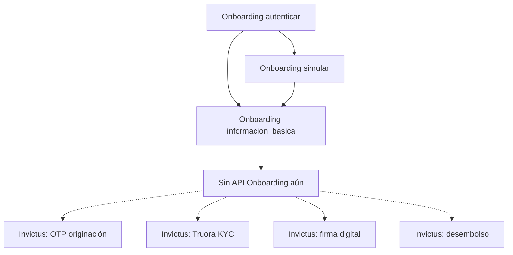

# Mapa Onboarding: auth → simulación → información básica

Fuente: código TESEO (`Api::OnboardingController`, `Onboarding::SimulacionService`, `Onboarding::InformacionBasicaService`, `Onboarding::ConfiguracionPortafolio`). **No modifica Invictus.** No hereda de `InvictusController`. No usa `/api/login`.

Este documento es el **mapa técnico**. Cada API implementada tiene su página. Swagger TESEO: `/api/docs/onboarding`.

Referencia de diseño: [Flujo Invictus](invictus_flujo.md) (originación → firma → desembolso). Onboarding **reutiliza ideas y servicios de cálculo**, no las rutas Invictus.

## Qué es Onboarding en TESEO

API genérica por `portafolio_id` del usuario JWT. El primer portafolio configurado es **10053** (cupo fijo). Campos, mensajes, rangos del simulador y `tipo` de `Formulario` salen de `parametros`.

Flujo real **hoy** (rutas en `config/routes.rb`):

1. **Auth** — `POST /api/onboarding/autenticar` emite JWT (1 hora) y devuelve `portafolio_id`.
2. **Simulación** — `POST /api/onboarding/simular` calcula cupo fijo (no persiste).
3. **Información básica** — `POST /api/onboarding/informacion_basica` crea o actualiza `Formulario` (tipo parametrizado; fallback `ONBOARDING`). No toca filas `tipo: INVICTUS`.

No hay OTP, Truora, firma digital ni desembolso en este catálogo. Esos pasos existen solo en Invictus.

## Diagrama general (implementado)



`simular` e `informacion_basica` son independientes entre sí. Ambos exigen JWT. El cliente puede simular primero (mostrar cuota) y luego registrar datos, o registrar datos si ya tiene el monto.

## Envelope JSON (regla de oro)

Éxito y error de negocio del controller Onboarding:

```json
{
  "status": "success",
  "datos": {},
  "errors": []
}
```

Error de negocio:

```json
{
  "status": "error",
  "datos": {},
  "errors": ["texto"]
}
```

**Excepción:** JWT inválido/ausente/expirado (`ApiJwtAuthenticatable`) **no** usa `datos`/`errors`. Usa `mensaje`:

```json
{
  "status": "error",
  "mensaje": "Token de autorización inválido o ausente"
}
```

Login Invictus (`POST /api/login`) usa otro contrato (`status: true/false`, `auth_token` en raíz). No mezclar.

## Comparación con Invictus

| Etapa | Invictus (existe) | Onboarding (hoy) | Correspondencia |
|-------|-------------------|------------------|-----------------|
| Auth | `POST /api/login` | `POST /api/onboarding/autenticar` | Mismo `AuthenticateUser` + JWT 1h. Envelope distinto. Onboarding además devuelve `user_id` y `portafolio_id`. |
| Simulación comercial | Vista web `/simulador` (no es API Invictus) | `POST /api/onboarding/simular` | **Paso extra de Onboarding.** Matemática = `PlaneshsimulaCreditoService` (misma que desembolso digital Invictus / `calcular_desembolso`). No persiste. |
| Originación | `POST /api/ori_invictus` | `POST /api/onboarding/informacion_basica` | Ambos persisten `Formulario`. Invictus: portafolio 10053, `tipo: INVICTUS`, listas, mora, Experian, OTP generado sin enviar, estados `estado_invictus`. Onboarding: `tipo` parametrizado, validación de campos CSV, **sin** listas/Experian/OTP/estados Invictus. |
| OTP originación | `notificacion_canal`, `reenviar_otp`, `validar_otp` | **No existe** | Pendiente si el producto lo requiere. |
| KYC Truora | webhook `truora/webhook_invictus` | **No existe** | Invictus cierra originación cuando `EN_VERIFICACION`. |
| Firma digital | `validacion_firma_digital`, `validacion_otp_firma`, `reenvio_otp_firma` | **No existe** | Invictus pasa a `APROBADO`. |
| Desembolso | `validacion_credito_vigente` → OTP → `seleccionar_linea_credito` → `calcular_desembolso` → `proceso_desembolso` | **No existe** | `simular` **no** es desembolso. Solo cotiza. |
| Persistencia | `Formulario` `tipo: INVICTUS` | `Formulario` `tipo` = `onboarding_formulario_tipo` (10053 suele ser `DIGITAL`; fallback código `ONBOARDING`) | Filtro por `tipo` + `portafolio_id` + `identificacion`. No pisa solicitudes Invictus. |

## Qué hace cada etapa (detalle)

### 1. Auth — implementado

| | |
|--|--|
| **Cuándo** | Primer paso. Sin `Authorization`. |
| **Recibe** | `username`, `password` |
| **Hace** | `User.find_for_authentication` + `AuthenticateUser.call` → JWT `{ user_id, exp }` |
| **Siguiente** | Bearer en `simular` y/o `informacion_basica` |
| **Página** | [Autenticar](onboarding_autenticar.md) |

### 2. Simulación — implementado (no es originación ni desembolso)

| | |
|--|--|
| **Cuándo** | Tras autenticar. Antes de mostrar términos al usuario. |
| **Recibe** | `monto` + `plazo` (`cuota` = alias de `plazo`) |
| **Hace** | Valida rango de parámetros del portafolio → `PlaneshsimulaCreditoService.calcular` + `plan_pagos` |
| **No hace** | No crea `Formulario`. No exige OTP. No desembolsar. |
| **Siguiente** | UI muestra cuota/desembolso. Luego `informacion_basica`. |
| **Página** | [Simular](onboarding_simular.md) |

Equivalente Invictus más cercano: `POST /api/calcular_desembolso` (simulación sin persistir, **en etapa desembolso**, con solicitud ya `APROBADO`). En Onboarding el cálculo ocurre **antes** de originar.

### 3. Originación ligera — implementado

| | |
|--|--|
| **Cuándo** | Tras autenticar (con o sin simular). |
| **Recibe** | `{ datos: { ...campos } }` |
| **Hace** | CSV habilitados/obligatorios → formato email/celular/fechas → create/update `Formulario` |
| **No hace** | Listas restrictivas, Experian, Truora, generación OTP, `estado_invictus`, validadores Credintegral (`save(validate: false)`) |
| **Siguiente** | Conservar `guid` (`transaction_id_teseo`) para servicios futuros. Hoy no hay siguiente API Onboarding. |
| **Página** | [Información básica](onboarding_informacion_basica.md) |

Equivalente Invictus: `POST /api/ori_invictus`, pero recortado a persistencia de datos.

### 4. Firma de documentos — no implementado

En Invictus: OTP de firma cuando `estado_invictus = APROBADO_PENDIENTE_FIRMA`. Ver [Firma digital](validacion_firma_digital.md).

Onboarding no expone rutas de firma. No llamar `/api/validacion_firma_digital` con un `guid` de Onboarding: ese flujo espera `Formulario` Invictus.

### 5. Desembolso — no implementado

En Invictus: OTP desembolso + líneas + `proceso_desembolso` irreversible. Ver [Desembolso](invictus_desmebolso.md).

Onboarding no expone esas rutas. `simular` solo cotiza.

## APIs por etapa (solo rutas reales)

| Etapa | Método | Ruta | Estado | Página |
|-------|--------|------|--------|--------|
| Auth | POST | `/api/onboarding/autenticar` | Implementado | [Autenticar](onboarding_autenticar.md) |
| Simulación | POST | `/api/onboarding/simular` | Implementado | [Simular](onboarding_simular.md) |
| Originación | POST | `/api/onboarding/informacion_basica` | Implementado | [Información básica](onboarding_informacion_basica.md) |
| OTP / KYC / Firma / Desembolso | — | — | **No hay rutas** | Usar mapa [Invictus](invictus_flujo.md) solo como referencia de diseño |

## Diagrama vs Invictus (qué falta)



Líneas punteadas = referencia de producto, **no** son llamadas válidas desde un `guid` Onboarding.

## Componentes

| Pieza | Rol |
|-------|-----|
| `Api::OnboardingController` | 3 acciones. Envelope `status` / `datos` / `errors`. |
| `ApiJwtAuthenticatable` | JWT Bearer (mismo secreto que `/api/login`). |
| `AuthenticateUser` | Emisión de token (mismo comando que login TESEO). |
| `Onboarding::ConfiguracionPortafolio` | Lee `parametros` por `portafolio_id`. Defaults en código si no hay fila. |
| `Onboarding::SimulacionService` | Rangos + `PlaneshsimulaCreditoService`. |
| `Onboarding::InformacionBasicaService` | Validación de campos y persistencia. |
| `PlaneshsimulaCreditoService` | Tabla `planeshsimula`. Compartido con `/simulador` e Invictus digital. |
| `Formulario` | Misma tabla que Invictus. Discriminador: `tipo` + `portafolio_id`. |
| `User.portafolio_id` | Define qué parámetros aplican. No viaja en el body. |

## Parámetros de negocio (por `portafolio_id`)

Si no existe fila en `parametros`, el código usa el default.

| Parámetro (`descripcion`) | Default | Uso |
|---------------------------|---------|-----|
| `onboarding_campos_habilitados` | CSV identidad/contacto | Campos aceptados en `datos` |
| `onboarding_campos_obligatorios` | CSV (sin segundo nombre/apellido ni teléfono) | 422 si faltan |
| `onboarding_formulario_tipo` | `ONBOARDING` | `formularios.tipo` (10053 suele parametrizarse `DIGITAL`) |
| `onboarding_sim_monto_min` | 200000 | Rango simulador |
| `onboarding_sim_monto_max` | 1000000 | |
| `onboarding_sim_monto_step` | 10000 | El monto debe caer en el step |
| `onboarding_sim_plazo_min` | 1 | |
| `onboarding_sim_plazo_max` | 6 | |
| `onboarding_param_tasa_id` | 54 | `Parametro` tasa EA |
| `onboarding_param_firma_id` | 60 | Costo firma electrónica (informativo en simulación) |
| `onboarding_param_estudio_id` | 10940 | Costo estudio crédito |
| `onboarding_msg_*` | ver `ConfiguracionPortafolio::MSG` | Textos de respuesta |

## Swagger

En TESEO (dev / testing-sygma / `API_SWAGGER=1`): `/api/docs/onboarding`

Specs en repo app: `doc/api/onboarding.yaml` + `doc/api/onboarding_guia.yaml`.

## Aislamiento respecto a Invictus

- Rutas distintas (`/api/onboarding/*` vs `/api/ori_invictus`, `/api/login`, etc.).
- Controller propio. Cero herencia Invictus.
- `informacion_basica` filtra `Formulario` por `tipo` Onboarding. No actualiza `tipo: INVICTUS`.
- `save(validate: false)` evita disparar validadores Credintegral de portafolio 10053 (esos validadores no distinguen tipo).
- Mismo JWT secret que el resto de APIs TESEO: un token de `autenticar` **sí** autenticaría técnicamente otras APIs JWT. El contrato de negocio de Onboarding es usar solo `/api/onboarding/*`.
